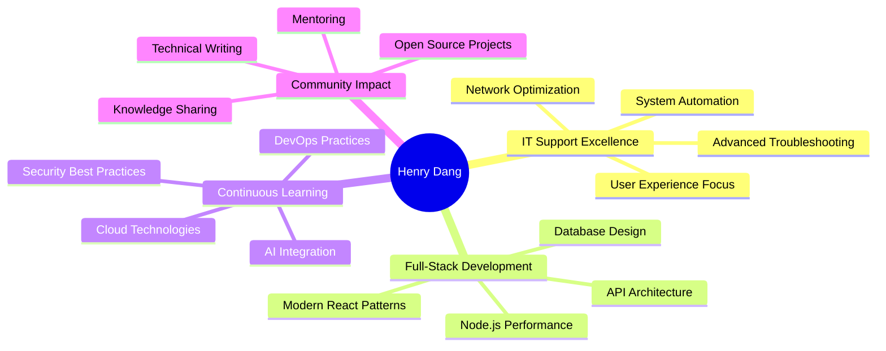

<div align="center">

# **Dang Ngoc Quy** (Henry Dang)


---

### **🚀 About Me**

<div align="center">

```typescript
const henry: Developer = {
  code: ["JavaScript", "Python", "TypeScript", "SQL"],
  askMeAbout: ["web dev", "tech support", "system admin", "problem solving"],
  technologies: {
    frontEnd: {
      js: ["React", "Next.js", "Vue.js"],
      css: ["Tailwind", "Bootstrap", "SASS"]
    },
    backEnd: {
      js: ["Node.js", "Express", "Nest.js"],
      python: ["Django", "Flask", "FastAPI"]
    },
    databases: ["MongoDB", "SQL Server", "Firebase", "PostgreSQL"],
    devOps: ["Docker", "Nginx", "Ubuntu", "AWS"],
    tools: ["Git", "VS Code", "Postman", "ServiceNow"]
  },
  currentFocus: "Building scalable web applications and providing top-tier IT support",
  funFact: "I debug systems like Sherlock Holmes solves mysteries! 🕵️‍♂️"
};
```

</div>

---

### **💼 Professional Skills Matrix**

<div align="center">

| **Category** | **Technologies** | **Experience Level** |
|---|---|---|
| **🖥️ IT Support** | Windows, macOS, Mobile OS, Network Troubleshooting |  |
| **🌐 Frontend** | React, JavaScript, HTML5, CSS3, Responsive Design |  |
| **⚙️ Backend** | Node.js, Express.js, Python, API Development |  |
| **🗄️ Databases** | MongoDB, SQL Server, Firebase, Data Modeling |  |
| **🔧 DevOps** | Ubuntu, Nginx, Git, CI/CD, System Administration |  |
| **📊 Project Management** | Agile, Scrum, Ticket Management, Asset Management |  |

</div>

---

### **🛠️ Tech Stack & Tools**

<div align="center">

**💻 Operating Systems & Support**
<br/>


**🌐 Web Development**
<br/>


**🗄️ Databases & Storage**
<br/>


**🔧 IT Support & Networking**
<br/>


**⚡ Tools & DevOps**
<br/>


</div>

---

### **📊 GitHub Analytics**

<div align="center">


</div>

---

### **🏆 GitHub Achievements & Trophies**

<div align="center">
  
</div>

---

### **🚀 Featured Projects**

<div align="center">

<table>
<tr>
<td width="50%">
<h3 align="center">🔍 CSS Survey System</h3>
<div align="center">  
<a href="https://github.com/dangngocquy/css_niso" target="_blank">

</a>
<br>
<br>
<p><strong>Multi-brand survey collection system</strong></p>
<p>Express.js • MSSQL • Ant Design</p>
<a href="https://css.niso.com.vn:3008/" target="_blank">🌐 Live Demo</a>
</div>
</td>

<td width="50%">
<h3 align="center">✅ Smart Checklist</h3>
<div align="center">
<a href="https://github.com/dangngocquy/checklist_niso" target="_blank">

</a>
<br>
<br>
<p><strong>Internal checklist with friendly UI</strong></p>
<p>React • Node.js • MongoDB</p>
<a href="https://css.niso.com.vn:3008/" target="_blank">🌐 Live Demo</a>
</div>
</td>
</tr>

<tr>
<td width="50%">
<h3 align="center">🎫 Maycha Checklist</h3>
<div align="center">
<a href="https://github.com/dangngocquy/maycha_checklist" target="_blank">

</a>
<br>
<br>
<p><strong>Automatic voucher management</strong></p>
<p>React • Node.js • Firebase</p>
<a href="https://checklist.tamhao.com.vn/" target="_blank">🌐 Live Demo</a>
</div>
</td>

<td width="50%">
<h3 align="center">📊 Risk Report System</h3>
<div align="center">
<a href="https://github.com/dangngocquy/report_niso" target="_blank">

</a>
<br>
<br>
<p><strong>Smart risk reporting dashboard</strong></p>
<p>Python • JavaScript • MongoDB</p>
<a href="https://report.niso.com.vn:3000/" target="_blank">🌐 Live Demo</a>
</div>
</td>
</tr>
</table>

</div>

---

### **📈 Contribution Activity**

<div align="center">
  
</div>

---

### **💡 Current Focus & Goals**

<div align="center">



</div>

---

### **🎯 2024-2025 Roadmap**

<div align="center">

| **Q4 2024** | **Q1 2025** | **Q2 2025** | **Q3 2025** |
|---|---|---|---|
| 🔧 Advanced IT Automation | ☁️ AWS Cloud Certification | 🚀 Microservices Architecture | 🤖 AI Integration Projects |
| 🌐 Next.js Mastery | 🐳 Docker & Kubernetes | 📱 Mobile App Development | 🔒 Cybersecurity Focus |
| 📊 Data Analytics Tools | 🧪 Testing Automation | 🎨 UI/UX Enhancement | 🌍 Open Source Contributions |

</div>

---

### **🌟 Fun Facts & Interests**

<div align="center">


**When I'm not coding or troubleshooting:**
- 🎮 Gaming & Technology Exploration
- 📚 Reading Tech Blogs & Documentation  
- 🏃‍♂️ Running & Outdoor Activities
- 🎵 Music & Podcast Enthusiast
- 📝 Writing Technical Articles

</div>

---

### **🌐 Connect & Collaborate**

<div align="center">

[](http://dangngocquy.id.vn/contact)
[](https://github.com/dangngocquy)
[](mailto:dangngocquy.business@gmail.com)
[](#)
[](#)

**💬 Let's talk about:**
- Web Development & System Architecture
- IT Support & Infrastructure Solutions  
- Open Source Collaboration
- Career Opportunities
- Tech Trends & Innovation

</div>

---

### **📊 Detailed Stats**

<div align="center">


</div>

---

### **🎖️ Certifications & Recognition**

<div align="center">

| **Area** | **Achievement** | **Status** |
|---|---|---|
| 🔧 **IT Support** | Advanced Troubleshooting Specialist | ✅ Certified |
| 🌐 **Web Development** | Full-Stack JavaScript Developer | ✅ Certified |
| 📊 **Project Management** | Agile & Scrum Methodologies | ✅ Certified |
| ☁️ **Cloud Computing** | AWS Solutions Architect | 🔄 In Progress |
| 🔒 **Security** | CompTIA Security+ | 📅 Planned 2025 |

</div>

---

<div align="center">
  
  
  ### **"Building solutions, one commit at a time"**
  
  
  [](https://github.com/dangngocquy)
  [](https://github.com/dangngocquy)
  
  **⭐ If you find my work helpful, please consider giving a star to my repositories!**
  
</div>
